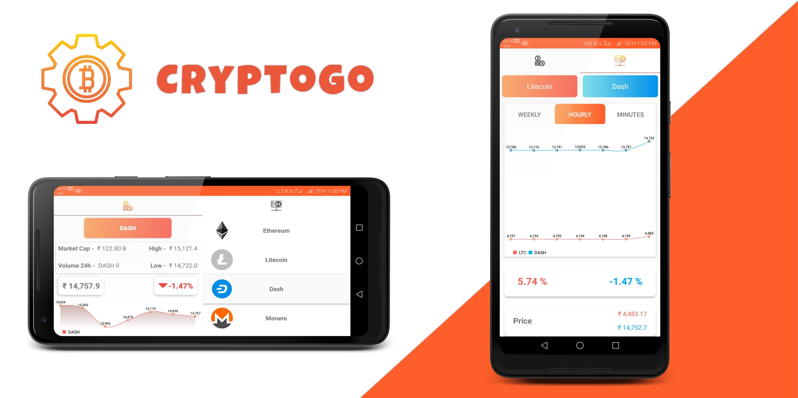
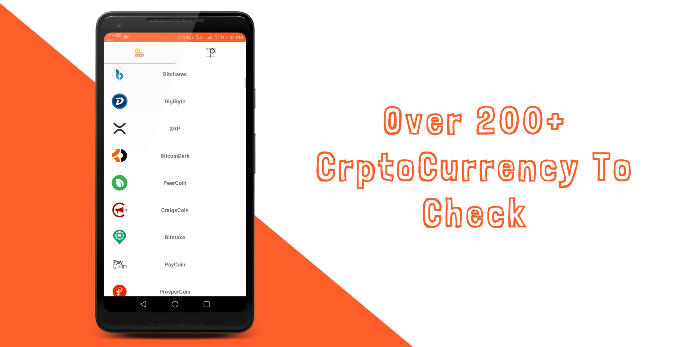
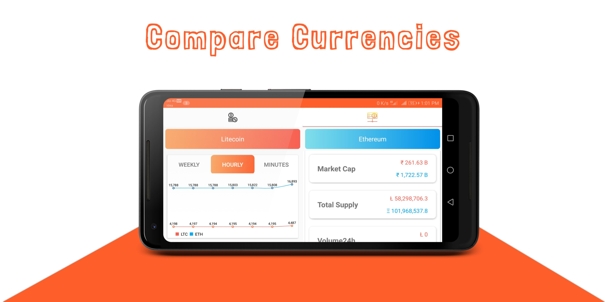

 
 

# CryptoGo

A Application where you can see real time data of Cryptocurrency. With a simple design it allows user to see details of 200+ Cryptocurrency
and allows to compare currencies against each other.
 
<h3>Hard to decide where to invest?</h3> 

CryptoGo fetch the historical data of currency. You can watch history price of currency on weekly, hourly and minutes basis.
It provides real time detail of currency with maximum delayed of 30 sec.

# Libraries Used

  * ButterKnife
  * Retrofit
  * GSON
  * hdodenhof/CircleImageView
  * Picasso
  * MPAndroidChart v3.0.3
  

# Working

CryptoGo fetch data from cryptocompare api which is a free cryptocurrency data provider. MVP architecture is used to design the application.
For the networking task retrofit library is used. 
User can select from over more than 200+ cryptocurrency (Actual size provided by api is more than 3000+ so we can change that too.)
and can see details analysis of cryptocurrency.
Currency are order according to their rank in market. User can also compare two currencies and can see detail difference between them.
MPAndroid chart library is used for displaying graphs. Different layout is provided for landscape mode.

# Features

 

 

 

# Contribute

Feel free to fork this project, and add new feature and design.
 
Then make a merge-request after updated the README with a sample of your design, include all screenshot.

#  Acknowledgement
  
   * [CryptoCompare](https://min-api.cryptocompare.com)
   * [FlatIcon](https://www.flaticon.com)
   * [Dribble](https://dribbble.com/shots/5112891-Crypto-Wallet-concept-app?utm_source=Clipboard_Shot&utm_campaign=patrykpolak&utm_content=Crypto%20Wallet%20-%20concept%20app&utm_medium=Social_Share)

